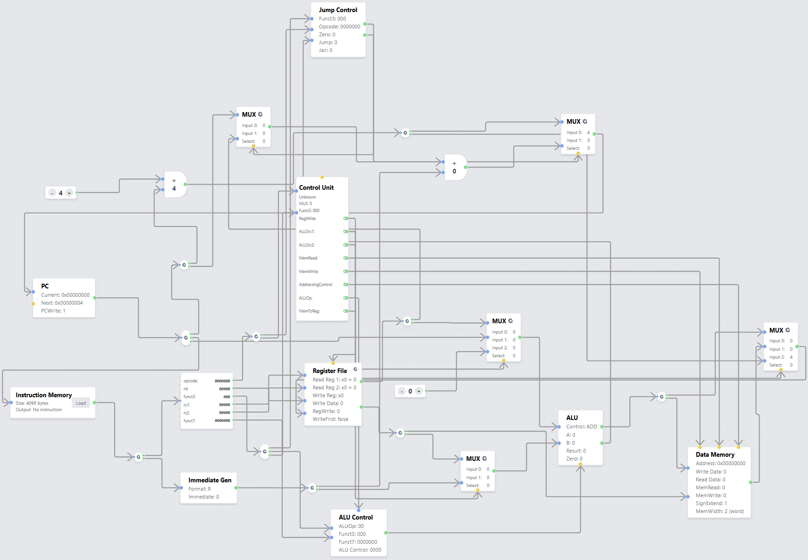
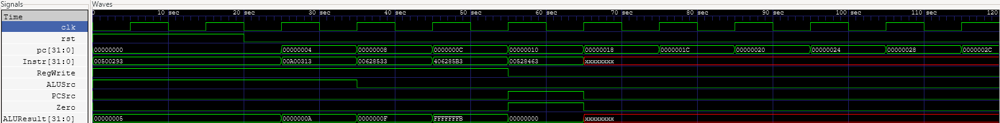
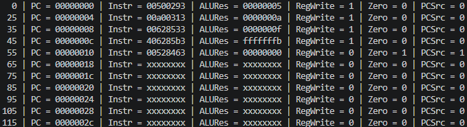

# RISC-V Single Cycle Processor (Verilog)

## Descripción

Este proyecto consiste en la implementación de un procesador **RISC-V Single Cycle** utilizando **Verilog**. La arquitectura está basada en un diseño monociclo, donde cada instrucción completa todas las etapas de ejecución dentro de un único ciclo de reloj.

El procesador implementa instrucciones como operaciones aritméticas, lógicas, acceso a memoria y saltos condicionales.

### Instrucciones soportadas

#### Tipo R

* `add`
* `sub`
* `and`
* `or`
* `slt`

#### Tipo I

* `addi`
* `lw`

#### Tipo S

* `sw`

#### Tipo B

* `beq`

---

# Arquitectura del Procesador

La implementación sigue una arquitectura **Single Cycle**, donde cada instrucción realiza las siguientes etapas en un único ciclo de reloj:

1. Fetch (búsqueda de instrucción)
2. Decode (decodificación)
3. Execute (ejecución)
4. Memory Access (acceso a memoria)
5. Write Back (escritura de resultados)

Este enfoque simplifica el diseño del hardware a costa de aumentar el tiempo de ciclo, ya que cada instrucción debe completarse completamente antes de iniciar la siguiente.

---

# Datapath del Procesador

La siguiente figura muestra el datapath completo implementado para el procesador RISC-V Single Cycle, se realizó el diagrama en el simulador **RISC-V Simulator**.

## Diagrama del Datapath



En este datapath se pueden identificar los principales bloques funcionales del procesador:

* Program Counter (PC)
* Memoria de instrucciones
* Unidad de control
* Banco de registros
* Generador de inmediatos
* ALU
* Memoria de datos
* Multiplexores
* Sumadores para PC+4 y Branch Target

---

# Descripción de los Módulos

## SingleCycle_Top.v

Módulo principal del procesador. Se encarga de interconectar todos los bloques funcionales del datapath y coordinar el flujo de información entre ellos.

Funciones principales:

* Conexión de todos los módulos.
* Generación del flujo de ejecución.
* Manejo de señales de control.
* Implementación de la lógica de Write Back.

---

## Program_Counter.v

Implementa el contador de programa (PC).

Responsabilidades:

* Almacenar la dirección de la instrucción actual.
* Actualizar el PC en cada flanco positivo de reloj.
* Reiniciar la ejecución cuando se activa la señal de reset.

---

## Instruction_Memory.v

Memoria de instrucciones utilizada para almacenar el programa a ejecutar.

Características:

* Lectura combinacional.
* Carga automática mediante `$readmemh`.
* Acceso direccionado por el Program Counter.

El programa se almacena en:

```text
instrMem.hex
```

---

## Control_Unit.v

Unidad de control principal encargada de generar todas las señales de control necesarias para el funcionamiento del procesador.

Internamente integra:

* Main_Decoder
* ALU_Decoder

Señales generadas:

* RegWrite
* MemWrite
* ALUSrc
* ResultSrc
* PCSrc
* ImmSrc
* ALUControl

---

## Main_Decoder.v

Decodifica el campo opcode de la instrucción y genera las señales de control generales del datapath.

Entre las señales generadas se encuentran:

* RegWrite
* MemWrite
* ALUSrc
* ResultSrc
* ImmSrc
* ALUOp

---

## ALU_Decoder.v

Genera la señal de control de la ALU utilizando:

* ALUOp
* funct3
* funct7

Permite seleccionar la operación específica que realizará la ALU.

---

## Register_File.v

Implementa el banco de registros del procesador.

Características:

* 32 registros de propósito general.
* Registros de 32 bits.
* Dos puertos de lectura.
* Un puerto de escritura.
* El registro x0 siempre contiene el valor cero.

---

## ALU.v

Unidad Aritmético-Lógica responsable de ejecutar las operaciones matemáticas y lógicas.

Operaciones implementadas:

| ALUControl | Operación |
| ---------- | --------- |
| 000        | ADD       |
| 001        | SUB       |
| 010        | AND       |
| 011        | OR        |
| 101        | SLT       |

Además genera la señal:

* `Zero`

La señal `Zero` es utilizada para evaluar instrucciones de salto condicional (`beq`).

---

## Extend.v

Generador de inmediatos encargado de realizar la extensión de signo para distintos formatos de instrucción.

Formatos soportados:

* I-Type
* S-Type
* B-Type

Su salida es utilizada como operando de la ALU y para el cálculo de direcciones de salto.

---

## Data_Memory.v

Memoria de datos utilizada por las instrucciones de carga y almacenamiento.

Características:

* 256 palabras de memoria.
* Lectura combinacional.
* Escritura síncrona.

Instrucciones soportadas:

* `lw`
* `sw`

---

## Multiplexor.v

Multiplexor de dos entradas utilizado en distintos puntos del datapath.

Funciones principales:

* Selección del siguiente valor del PC.
* Selección del operando B de la ALU.
* Selección de la fuente de datos para Write Back.

---

## Adder.v

Sumador de 32 bits utilizado para operaciones de direccionamiento.

Aplicaciones:

* Cálculo de PC + 4.
* Cálculo de la dirección objetivo de un branch.

---

# Programa de Prueba

El programa cargado en la memoria de instrucciones es el siguiente:

```text
00500293
00a00313
00628533
406285b3
00528463
00000000
```

Equivalente aproximado en ensamblador RISC-V:

```assembly
addi x5, x0, 5
addi x6, x0, 10
add  x10, x5, x6
sub  x11, x5, x6
beq  x5, x5, label
nop
```

Este programa permite verificar:

* Escritura de registros.
* Lectura de registros.
* Operaciones aritméticas.
* Comparaciones mediante la ALU.
* Actualización correcta del Program Counter.
* Funcionamiento de instrucciones de salto condicional.

---

# Testbench

## SingleCycle_Top_tb.v

Se encarga de verificar el funcionamiento completo del procesador.

Funciones implementadas:

* Generación de reloj.
* Aplicación de reset.
* Ejecución automática del programa de prueba.
* Monitoreo de señales internas.
* Generación de archivo VCD para GTKWave.

Se monitorean las siguientes señales:

* PC
* Instr
* ALUResult
* RegWrite
* Zero
* PCSrc

---

# Resultados de Simulación

## Simulación en GTKWave



La simulación permite observar el comportamiento temporal de las señales internas del procesador durante la ejecución del programa.

Se verifica el correcto funcionamiento de:

* Program Counter
* Memoria de instrucciones
* Banco de registros
* ALU
* Señales de control
* Saltos condicionales

---

## Ejecución del Testbench



La salida generada por el testbench muestra la evolución del procesador durante la ejecución del programa de prueba.

Esta información permite validar:

* La secuencia correcta de instrucciones.
* Los resultados producidos por la ALU.
* La activación de señales de control.
* La actualización adecuada del Program Counter.

---

# Simulación

## Compilación con OSSCAD

```bash
iverilog -o testbench.out Adder.v ALU_Decoder.v ALU.v Control_Unit.v Data_Memory.v Extend.v Instruction_Memory.sv Main_Decoder.v Multiplexor.v Program_Counter.v Register_File.v SingleCycle_Top.v SingleCycle_Top_tb.v 
```

## Ejecución de la simulación

```bash
vvp testbench.out
```

## Visualización de señales con GTKWave

```bash
gtkwave SingleCycle_Top_tb.vcd
```

---
